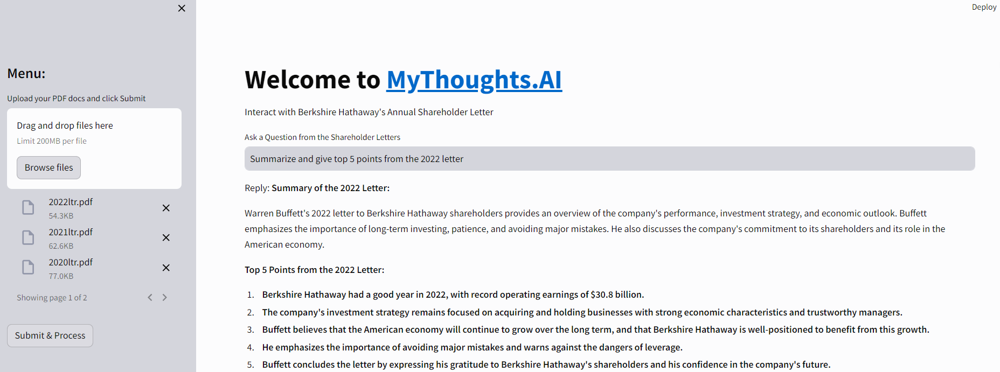

# MyThoughts.AI
# Chat with Multiple PDFs using Google Gen AI
This a prototype appllication which takes multiple pdf as input and then answer's questions about the pdf file using Google Gen AI Chat.
Please find below the documentation with explanations of functions and steps to run the application.

## Explanation of Functions

This section explains the functionalities of each function within the code:

**1. `get_pdf_text(pdf_bytes)`**

* **Purpose:** Extracts text content from uploaded PDF files.
* **Parameters:**
    * `pdf_bytes (bytes)`: The raw byte data representing the uploaded PDF document.
* **Returns:**
    * `str`: The extracted text content from all pages within the PDF.
* **Explanation:**
    1. Creates an in-memory stream (`io.BytesIO`) from the provided byte data.
    2. Initializes a `PdfReader` object from PyPDF2 to parse the PDF content.
    3. Iterates through each page in the PDF:
        - Extracts text using the page's `extract_text()` method.
    4. Concatenates the extracted text from all pages into a single string and returns it.

**2. `get_text_chunks(text)`**

* **Purpose:** Splits the extracted text into manageable chunks for vectorization (embedding generation).
* **Parameters:**
    * `text (str)`: The complete extracted text content from the PDF(s).
* **Returns:**
    * `list`: A list containing text chunks of a specified size with some overlap for context.
* **Explanation:**
    1. Utilizes `RecursiveCharacterTextSplitter` from LangChain:
        - `chunk_size (int, default=10000)`: Defines the maximum character length per chunk.
        - `chunk_overlap (int, default=1000)`: Specifies the number of characters to overlap between chunks for better context preservation.
    2. Splits the input text into chunks based on the configured parameters.
    3. Returns the list of text chunks.

**3. `get_vector_store(text_chunks)`**

* **Purpose:** Creates or loads a FAISS (Facebook AI Similarity Search) vector store for efficient text retrieval based on semantic similarity.
* **Parameters:**
    * `text_chunks (list)`: The list of text chunks obtained from `get_text_chunks()`.
* **Returns:**
    * `FAISS` object: The created or loaded FAISS vector store containing embeddings for the text chunks.
* **Explanation:**
    1. Initializes `GoogleGenerativeAIEmbeddings` using a pre-trained embedding model (`model="models/embedding-001"`) and the provided Google API key (`google_api_key`).
    2. Attempts to load an existing FAISS vector store from the local file "faiss_index".
        - If the file doesn't exist, a new vector store is created:
            - The `FAISS.from_texts()` method generates embeddings for each text chunk using the specified embedding model.
            - The embeddings are stored in the FAISS vector store.
        - If the file exists, the existing vector store is loaded.
    3. Saves the vector store (new or loaded) back to the "faiss_index" file for future use.
    4. Returns the FAISS vector store object.

**4. `get_conversational_chain()`**

* **Purpose:** Defines a question-answering chain using LangChain components. This chain will process user questions and provide answers based on the uploaded PDF content.
* **Returns:**
    * `Chain` object: The LangChain question-answering chain.
* **Explanation:**
    1. Constructs a PromptTemplate specifying the desired conversational style for the AI model's responses:
        - The template includes placeholders for context (`{context}`) and questions (`{question}`).
        - It instructs the model to provide detailed answers based on context, mention "answer is not in the context" if no answer is found, and avoid generating incorrect information.
    2. Initializes a `ChatGoogleGenerativeAI` model (`model='gemini-pro'`), specifying the language model and temperature (controls randomness).
    3. Creates a LangChain `Prompt` object using the defined `PromptTemplate`.
    4. Loads a question-answering chain (`chain_type="stuff"`) using the `load_qa_chain()` function, providing the model, prompt, and chain type.
    5. Returns the constructed question-answering chain object.

**5. `user_input(user_question)`**

* **Purpose:** Processes user questions, retrieves relevant information from the uploaded PDFs using the FAISS vector store, and generates responses through the question-answering chain.
* **Parameters:**
    * `user_question (str)`: The user's question about the PDF

## Steps for Running the Application    

This section explains the steps for running the code:

### Getting Started

To run this application, ensure you have the necessary dependencies installed. You can install the required packages using `pip install -r requirements.txt`.

Additionally, you need to set up a Google API key and store it in a `.env` file. The key is required for accessing the Google Generative AI services. Ensure the `.env` file is in the same directory as the script, and it should contain the following: `GOOGLE_API_KEY=your_google_api_key_here`.

### Running the Application

To launch the Gen AI application, execute the script `app.py`. This will start a local server, and you can access the application via your web browser.
Use the following bash code: `streamlit run app.py`.

Once the application is running, follow the steps below:

1. **Upload PDF Documents:** Use the file uploader to upload one or more PDF documents.
2. **Submit & Process:** Click the "Submit & Process" button to extract text from the uploaded PDFs and process them for further interaction.
3. **Ask a Question:** Enter your question related to the content of the uploaded PDF files.
4. **View Response:** The application will provide a response based on the question asked, utilizing the context from the processed PDFs.

### Example Usage

